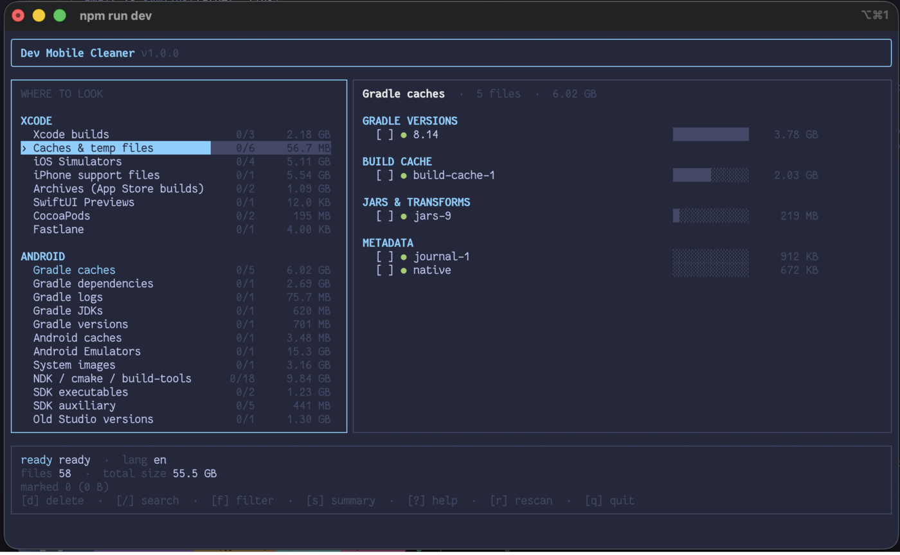

# Mobile Dev Cleaner

<p align="center">
  
</p>

Terminal app for macOS that scans and cleans junk left behind by Xcode and Android Studio. DerivedData, simulators, AVDs, Gradle caches, SDK toolchains, orphan IDE versions — all in one place, with safety rails.

Typically frees **20–40 GB** on an active mobile dev's Mac.

## Why

Xcode + Android Studio scatter caches, builds, downloaded SDKs, simulator state, and old IDE versions across half a dozen folders. There is no built-in cleanup. Generic "clean my Mac" tools either don't know about these paths or wipe stuff you actually need.

This tool knows the exact paths, classifies each one as either:

- 🟢 **safe** — regenerable junk (caches, build artifacts)
- 🟡 **costly** — works fine to delete but triggers re-downloads, slow rebuilds, or wipes simulator state

You decide what goes. Nothing is deleted without explicit confirmation.

## Install

Requires macOS and Node 20+.

```bash
npm install -g mobile-dev-cleaner
```

## Usage

### Interactive (recommended)

```bash
mdc
```

Opens a TUI dashboard. Navigate with arrows, mark items with `space`, delete with `d`.

Keys at a glance:

| Key | Action |
|---|---|
| `↑↓` | move through list / menu |
| `→ ⏎` | enter list from menu |
| `← ⌫ esc` | back to menu |
| `tab` | switch focus menu/list |
| `space` | mark/unmark item |
| `a` | mark/unmark all in current category |
| `1 2 3 0` | pick simulator/AVD action (clean / reset / delete / unmark) |
| `d` | delete marked |
| `s` | summary of what's marked |
| `/` | search current list |
| `f` | filter by risk (all / green / yellow) |
| `?` | full help |
| `r` | rescan |
| `l` | switch language (en/es) |
| `q` | quit |

### Headless / scripting

```bash
# Scan and emit JSON
mdc scan --json > plan.json

# Scan only one tool
mdc scan --tool xcode --json
mdc scan --tool android --json

# Edit plan.json to flip "selected": true on items you want gone, then:

# Dry run
mdc clean --plan plan.json

# Actually delete
mdc clean --plan plan.json --execute --yes
```

## What gets scanned

### Xcode
- DerivedData (build folders + global caches like `ModuleCache`)
- iOS / watchOS / tvOS / visionOS DeviceSupport
- iOS Simulators (per-device breakdown with clean/reset/delete actions)
- Simulator runtimes (system-wide, requires Full Disk Access)
- Xcode Previews
- Archives
- CocoaPods / Carthage / Fastlane caches
- Misc Xcode caches and logs

### Android
- Gradle caches (versions, build cache, jars/transforms, metadata)
- Gradle dependencies (`modules-2`)
- Gradle wrappers and JDKs
- Kotlin daemon logs
- AVDs (per-emulator with clean/reset/delete)
- Android SDK system images (cross-checked against active AVDs)
- SDK NDK / cmake / build-tools / platforms
- SDK binaries (emulator, deprecated tools)
- Old Android Studio versions (orphans from upgrades)

### What is **not** touched
By design, this tool refuses to scan or list anything that could break things:
- Keystores, signing certificates, provisioning profiles
- ADB keys, accepted Android licenses
- Active simulator/AVD runtimes in use
- Device backups
- Critical SDK binaries (`adb`, `cmdline-tools`, `platform-tools`, `licenses`)

If you want to touch those, you're on your own.

## Safety

- Default: nothing is pre-selected
- Single confirmation for green-only deletions
- Double confirmation for yellow operations (re-downloads, state loss)
- Refuses to delete while Xcode, Android Studio, Simulator.app, or a target AVD is running
- Persistent size cache (`~/Library/Caches/mdc/`) makes rescans nearly instant

## Languages

English and Spanish. Toggle in-app with `l`. Saved to `~/.config/mdc/config.json`.

## Privacy

- Never leaves your machine
- No telemetry
- No network calls

## Author

Built by [@LeoMogiano](https://github.com/LeoMogiano).

## License

MIT
